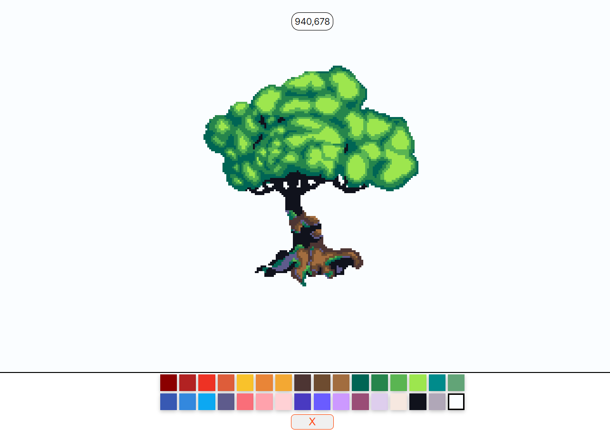

## Getting started 🚀
To get started with this project, clone the project then navigate to ./client and install all client dependencies with command.
```bash
npm install
```

## Docker
Run docker to start Redis in root folder
```bash
docker-compose up -d
```

## Start Server
To start the server, navigate to the root folder. You need to have `Golang` installed in your environment.
```bash
go run main.go
```
or
```bash
go build
./place-service
```

## Start Client
To start client in development mode
```bash
npm run dev
```

## Environment Variables
Rename `.env.sample` to `.env`
You can change the variables if necessary.

